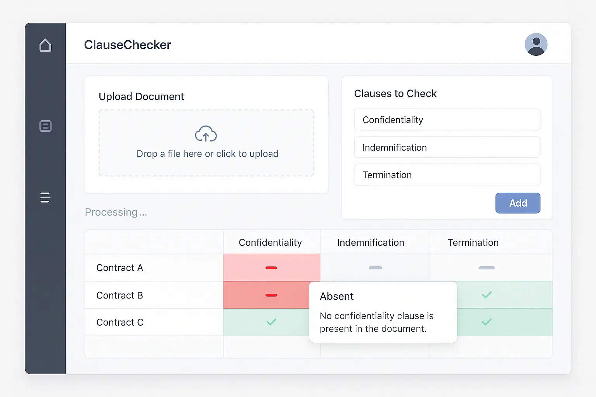
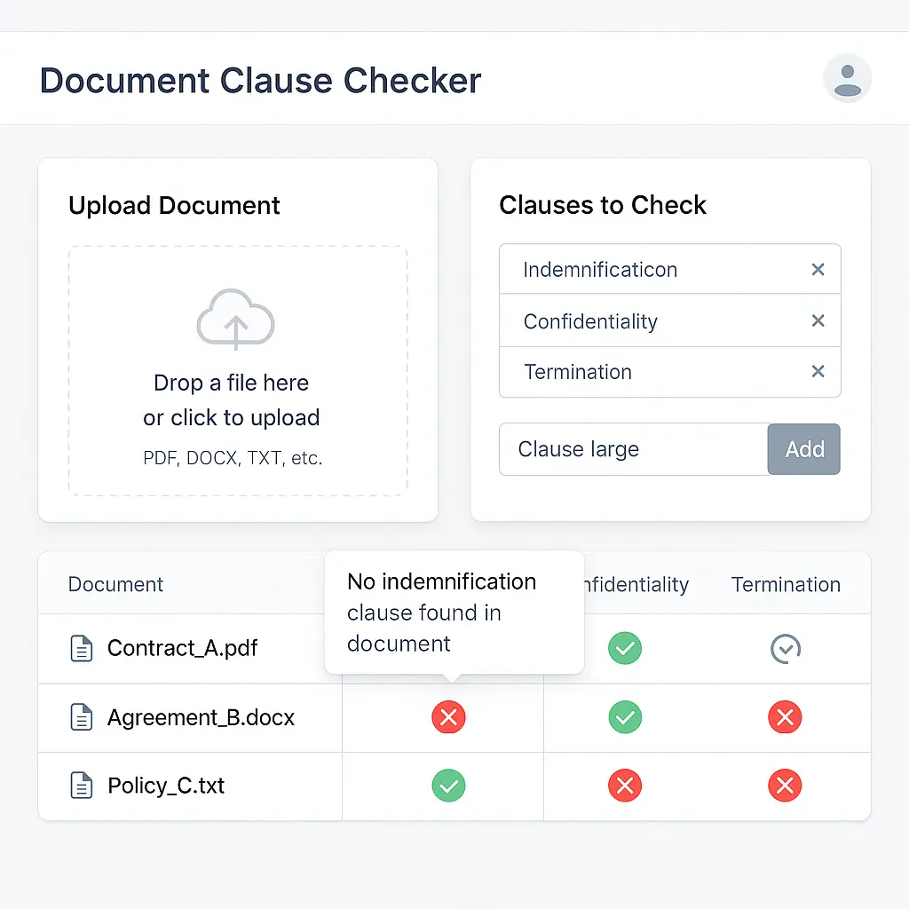
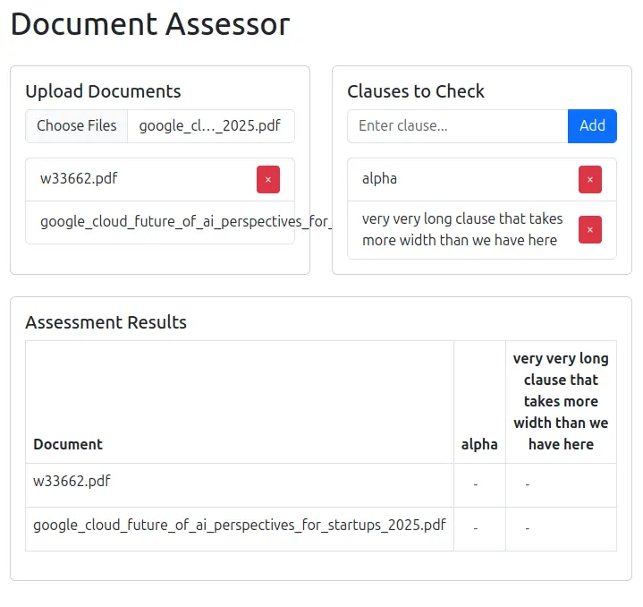
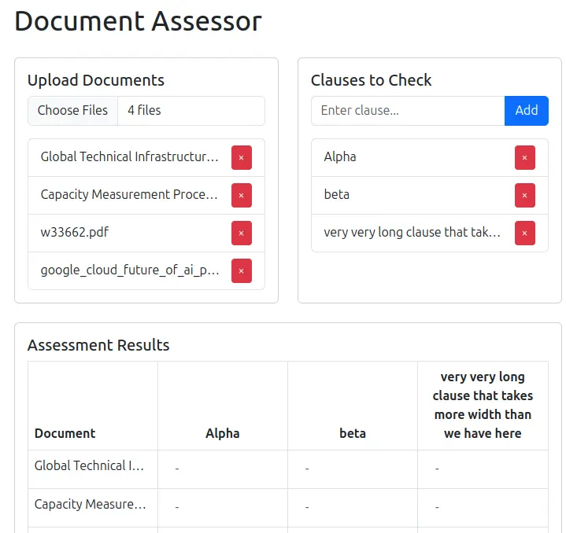
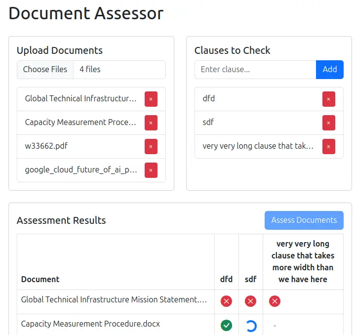
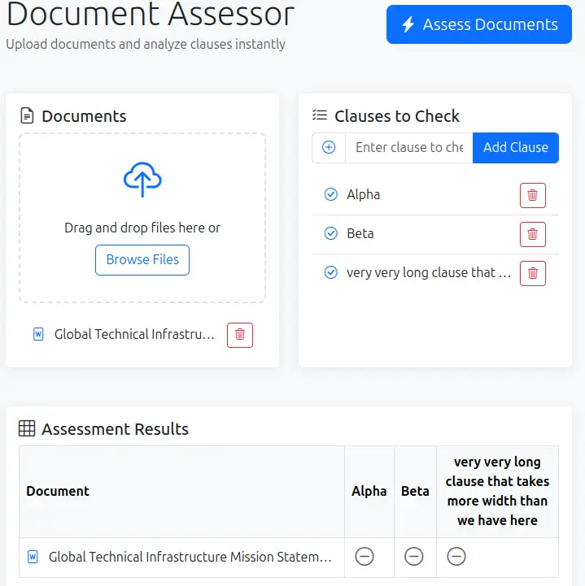
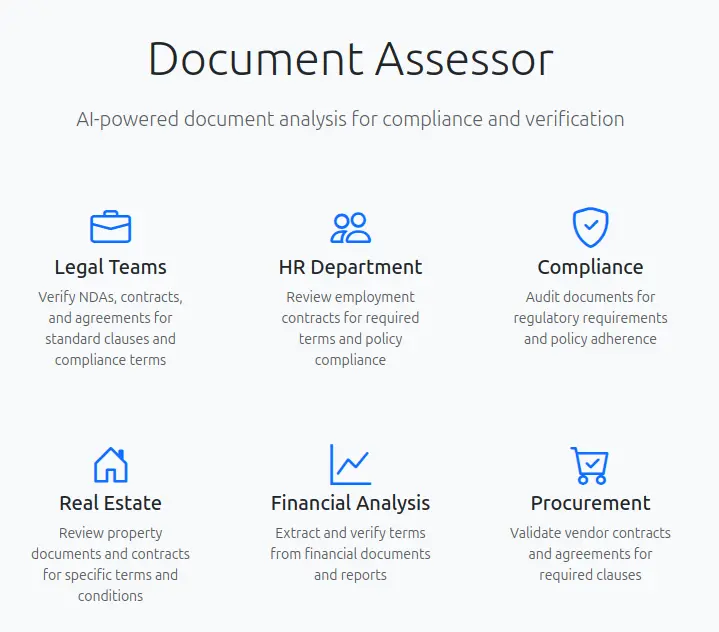

# Prompts

## Ideate Design

ChatGPT O4 Mini High:

> I want you to view the visual design or simply the full screenshot or pre-shot of an application for autonomous driving. This application is a document architecture. Users can upload articles, PDF files, or world documents, or any government documents. They can also specify a set of terms they want to access, seen in the document. For example, if it is a legal contract, they may want to specify the terms they want to access. They would specify these clauses one by one in a box, and once the application is done, the application will then send the document to an LLM, along with these clauses, check which of these clauses are present, yes or no, and return it along with a reason or a rationale. It should be a citation saying, here is where the clause is present, or here is the text that indicates this clause is present, or no, there is no such clause that is present. That may be the reason. This would be, as the documents are progressing, captured and the progress shown on the screen. You would also be, like, populating a table, where each of the documents is a row, and each of the clauses is a column, and the cells contain a visual indication, maybe with a graphic of colors, of the user. So, users would be able to see the progress as things are moving along, as the LLM is making the request. They see the first cell may be turned red, because the first request came through, and the first response has been populated, and the clause is not present. And then, it's still working on the second, so that may be a stringer in the second cell, and then it turns green, because the clause is present. They hover over any of these, or click on any of these, and a pop-up appears, showing the exact reason why that particular cell was created, or red, in which case, that's only the reason the clause is just getting from the document. I'd like you to create a beautiful, modern, visual design for this application.

The citation should reference the specific clause or text indicating whether it is present. If the clause is missing, the source should indicate that too. This could be represented visually on a table, where each document is a row and each clause is a column, with colors or other indicators in the cells showing the status of each clause across the documents. That way, the clauses' progress is tracked visually.

The user wants a beautiful, modern visual design for an app that tracks document progress. The UI should show progress updates where cells turn red or green based on whether clauses are present, with tooltips explaining the results upon hover or click. They might be asking for a more polished design or a mockup. We could suggest a layout or describe it as a React component structure using Tailwind and ShadCN UI, though I’m not sure if that’s exactly what they’re looking for. I'll focus on delivering a sleek, user-friendly concept.

> I don't need the sidebar. If there are several clauses, it should not spill over vertically and the Upload Document section and Clauses to Check section should have equal heights. Finally, I would like the cells to contain pretty icons -- it looks plain right now.

## Create Scaffolding

GitHub Copilot (Agent) with Claude 3.5 Sonnet:

> #file:README.md has the context of the application I'm building. #file:design-2.webp is the design I'm looking for.
> Create the SCAFFOLDING for this in #file:index.html using Bootstrap (minimize custom styles, prefer Bootstrap classes). Create a script.js that uses lit-html to implement basic functionality. For now, mock the LLM call as an API.
> Write VERY concise code.

[🔗 Commit](https://github.com/sanand0/assessor/commit/d72ff9d)

## Update Scaffolding

> The uploaded filenames should fit within the list and not go outside.
> Ensure that the table header height does not exceed 3 rows (in case there are long clauses).
> Ensure that the table's first column does not exceed 25 em width (in case there are long filenames).
> Convert files and store files as text as they are uploaded using Mammoth (for DOCX) and PDFJS (for PDF) via CDN.

> The table header row height still exceeds what we want. If it'll be complex to implement, undo all changes related to table row height.
> Add an "Assess" button that will trigger the assessment, at which point we will call the LLM API (mocked) document by document.
> Shorten and simplify #file:script.js. Avoid braces for single-line blocks. Make the code elegant, readable, modern.

[🔗 Commit](https://github.com/sanand0/assessor/commit/8363822)

## LLM Functionality

> Read https://github.com/sanand0/aipipe/blob/main/README.md to understand how to use it to make an LLM API call via AI Pipe.
> Search for and read the OpenAI documentation to understand how make calls to the GPT models. Send a request to gpt-4.1-mini as the model via AI Pipe.
> Assess document by document, asking the LLM to evaluate ALL clauses at one shot. Get a structured JSON schema-based response where, for each clause, we get a boolean Y/N as well as a REASON for the response. The reason will be shown on the tooltip.

## Update Functionality

> If the document has already been assessed, don't send it to the LLM for re-assessment when "Assess Documents" is clicked. Cache it - provided the clauses and document have not changed.
> When the user clicks on the table cells, show a Bootstrap popup with the reason.
> In case of errors, ALWAYS show them prominently to the user as a Bootstrap Toast notification.
> Don't truncate the input. Send the full input.
> Center the cells with icons.
> Restructure the code CONCISELY. Remove redundant code.

This caused an error.

> Uncaught ReferenceError: initAuth is not defined

[🔗 Commit](https://github.com/sanand0/assessor/commit/d166dac)

## Document README

> Create a *professional* README.md for this application. Use best practices.
> Explain WHY this app is useful, listing a few REAL-LIFE business use cases.
> Include these use cases in #file:index.html as well for users to get ideas. (Use good iconography and typography.)
> In README.md, explain how to use the app. > Include #file:prompts/functionality-1.webp as a screenshot.
> Add a section for developers explaining how to set it up. (It's a static HTML app.)
> The code is at https://github.com/sanand0/assessor and output at https://sanand0.github.io/assessor/
> The author is S Anand <root.node@gmail.com>.
> Add an MIT LICENSE.
> This app was 100% LLM vibe-coded with no manual intervention. The prompts are at #file:prompts/README.md. Add a section mentioning this.

[🔗 Commit](https://github.com/sanand0/assessor/commit/578fb93)

## Deployment

> Avoid GitHub running Jekyll actions.

## Code Review

[ChatGPT: O4-Mini-High](https://chatgpt.com/c/680627dd-bf50-800c-9d4a-cb1b3b82c7b9)

> Review the code at https://github.com/sanand0/assessor and provide a detailed assessment of how the code could be improved. Evaluate based on every possible candle a world class developer or architect would look at it from

... and then:

> Rank order each suggestion based on how easy or hard it is to implement. Then, rank order each of these based on the benefit to the end user. Based on both of these, suggest which are the quick wins I should go after, i.e., high benefit to the user and low effort to implement.

Summary of suggestions:

- Lazy‑load heavy libraries (#6)
- Input validation & sanitization (#9)
- Enforce file size/type limits (#10)
- Global progress indicator & cancellation (#17)

GitHub Copilot (Agent) with Claude 3.5 Sonnet:

> - Lazy‑load heavy libraries. PDF.js and Mammoth.js are large. Only load them when needed (e.g. dynamic imports inside convertFileToText), reducing initial payload.
> - Input validation & sanitization. User‑entered clauses (clause.text) get injected into the DOM and the LLM prompt verbatim. Escape or sanitize to prevent XSS in case future UI changes.
> - Enforce file size/type limits. Currently any .pdf/.docx/.txt can be uploaded. Impose client‑side size limits and alert the user.
> - Refactor the code into modular, modern, concise, readable ESM.
